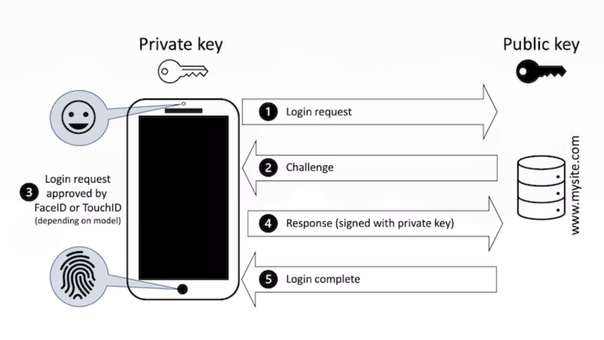

<div class="absolute top-10 w-88%" style="display: flex; justify-content: space-between">
  <div class="font-700">
    Daniel Ferecatu
  </div>
  <div class="text-small" style="color: grey">
   February 2025
  </div>
</div>

<div class="absolute bottom-10 text-left">
  <h1>Passkeys</h1>
  <p>the future of login</p>
</div>


---
layout: image-right
image: '/images/LinkedIn.jpeg'
hideInToc: true
---

# 👋 Hi, Daniel here!

<br />

* macOS Developer at Heimdal Security

* Co-Founder of <a href="https://www.linkedin.com/company/health-made-simple-ro">Health Made Simple</a>

* tech: Swift, Xcode, Cocoa, Azure DevOps, Angular, .NET Core, Docker, EF Core

<figure class="pl-4 pt-2">
  
  <figcaption style="font-size: smaller"><a href="https://linktr.ee/danielferecatu">linktr.ee/danielferecatu</a></figcaption>
</figure>


---
hideInToc: true
---

# What we'll cover today

<br />

<Toc />


---
layout: section
---

# 🗄️ How are passwords stored today?

---
layout: image-right
image: '/images/IU 2400x2400.png'
---

<div v-click>
❌ Insecure Storage Methods (avoid these!)
<ul>
  <li>Plaintext</li>
  <li>Hardcoded in code or configuration files</li>
</ul>
</div>
<br />
<div v-click>
🟡 Less Secure Methods
<ul>
  <li>Hashed Only (without Salt)</li>
  <li>Reversible Encryption</li>
</ul>
</div>
<br />
<div v-click>
✅ Secure Storage (recommended)
<ul>
  <li>Hashed & Salted (best practice) 🛡️</li>
  <li>Hardware Security Modules</li>
  <li>Encrypted Password Vaults</li>
</ul>
</div>
---

# What management solutions are there?
<br />

Password Managers

* native: <a href="https://www.lastpass.com/">LastPass</a> (free), <a href="https://1password.com/">1Password</a>, <a href="https://bitwarden.com/">Bitwarden</a> (open-source), <a href="https://www.dashlane.com/">Dashlane</a> (enterprise)

* browser extensions: <a href="https://chromewebstore.google.com/detail/proton-pass-free-password/ghmbeldphafepmbegfdlkpapadhbakde">Proton Pass</a>, <a href="https://chromewebstore.google.com/detail/nordpass%C2%AE-password-manage/eiaeiblijfjekdanodkjadfinkhbfgcd">NordPass</a>, <a href="https://chromewebstore.google.com/detail/keeper%C2%AE-password-manager/bfogiafebfohielmmehodmfbbebbbpei">Keeper</a>

* OS integration: <a href="https://support.apple.com/en-us/109016">Apple iCloud Keychain</a>, <a href="https://passwords.google/">Google Password Manager</a>, <a href="https://support.microsoft.com/en-us/account-billing/download-microsoft-authenticator-351498fc-850a-45da-b7b6-27e523b8702a">Microsoft Authenticator</a>


---

# What Exactly Is a Passkey?
<br />

A passkey is a passwordless authentication method that replaces traditional passwords with cryptographic keys.

<br />

It is based on public-key cryptography, where a pair of keys (private and public) is used for secure authentication.
The public key is stored on the server and the private key is stored on your device, encrypted.
Large vendors seamlessly synchronize them across multiple platforms.

<br />

Passkeys eliminate the need for users to create, remember, and manage passwords, reducing the risk of phishing attacks. Why? Because the actual private key is not sent over the network.


---
layout: section
---

# 🔀 Authentication flow

---

<div style="display: flex; justify-content: center">
  
</div>

--- 
layout: section
---

# 👨‍💻👩‍💻 Developer experience

---
hideInToc: true
---

# Register: Generate registration options

A challenge is a random, one-time value generated by a server to prevent replay attacks.

```js {all|1,3|1,5,6,8-12,20}{lines:true}
app.post('/register/start', (req, res) => {
    let username = req.body.username;
    let challenge = getNewChallenge();
    challenges[username] = convertChallenge(challenge);
    const pubKey = {
        challenge: challenge,
        rp: {id: rpId, name: 'webauthn-app'},
        user: {id: username, name: username, displayName: username},
        pubKeyCredParams: [
            {type: 'public-key', alg: -7},
            {type: 'public-key', alg: -257},
        ],
        authenticatorSelection: {
            authenticatorAttachment: 'platform',
            userVerification: 'required',
            residentKey: 'preferred',
            requireResidentKey: false,
        }
    };
    res.json(pubKey);
});
```
<!-- The browser will pass to a supported authenticator -->

---
hideInToc: true
---

# Register: Verify the attestation response

It occurs only during the initial registration of a passkey. It contains client's attestation certificate and signature, client data, public key, credential ID, and supported algorithms.

```js {all|1,5-8|1,13,14,16}{lines:true}
app.post('/register/finish', async (req, res) => {
    const username = req.body.username;
    let verification;
    try {
        verification = await SimpleWebAuthnServer.verifyRegistrationResponse({
            response: req.body.data,
            expectedChallenge: challenges[username],
            expectedOrigin: expectedOrigin
        });
    } catch (error) {
        return res.status(400).send({error: error.message});
    }
    const {verified, registrationInfo} = verification;
    if (verified) {
        users[username] = registrationInfo;
        return res.status(200).send(true);
    }
    res.status(500).send(false);
});
```

---
hideInToc: true
---

# Login: Create the challenge

Generate authentication options for the browser to pass to a FIDO2 authenticator

```js {all|1,6|1,8-17}{lines:true}
app.post('/login/start', (req, res) => {
    let username = req.body.username;
    if (!users[username]) {
        return res.status(404).send(false);
    }
    let challenge = getNewChallenge();
    challenges[username] = convertChallenge(challenge);
    res.json({
        challenge,
        rpId,
        allowCredentials: [{
            type: 'public-key',
            id: users[username].credentialID,
            transports: ['internal'],
        }],
        userVerification: 'preferred',
    });
});
```

---
hideInToc: true
---

# Login: Verify authentication response

```js {all|1,7-12}{lines:true}
app.post('/login/finish', async (req, res) => {
    let username = req.body.username;
    if (!users[username]) return res.status(404).send(false);
    let verification;
    try {
        const user = users[username];
        verification = await SimpleWebAuthnServer.verifyAuthenticationResponse({
            expectedChallenge: challenges[username],
            response: req.body.data,
            authenticator: user,
            expectedRPID: rpId,
            expectedOrigin,
            requireUserVerification: false
        });
    } catch (error) {
        return res.status(400).send({error: error.message});
    }
    const { verified } = verification;
    return res.status(200).send({
        res: verified
    });
});
```

---
hideInToc: true
---

# What happens on the browser in the meantime
<br />

Call the backend and handle the FIDO2 registration and authentication.

```js {all|2|3|4|8|10|11}{lines:true}
async registerStart() { 
  const publicKey = await this.http.post('/register/start', { username: this.username }).toPromise();
  const fidoData = await fido2Create(publicKey, this.username);
  const response = await this.http.post<boolean>('/register/finish', fidoData).toPromise();
}

async loginStart() {
  const response = await this.http.post('/login/start', { username: this.username }).toPromise();
  const options = response as PublicKeyCredentialRequestOptions;
  const assertion = await fido2Get(options, this.username);
  await this.http.post('/login/finish', assertion).toPromise();
}
```

---

# 🔍 A quest for you!
<br />
<div class="left-6 right-6" style="display: flex; justify-content: space-between; text-align: center">

<div>

<br />
Step-by-step walkthrough
</div>

<div>

<br />
Available features on your device
</div>

</div>

---
layout: statement
---

# Demo time!

<!-- go to https://webauthn.me -->

---
layout: bullets
---

# Why should you use Passkeys?

* 🚀 <em>Better User Experience</em><br /> No more forgotten passwords

* 💡 <em>Future-Proof Authentication</em><br /> Companies are rapidly adopting passkeys as a next-generation authentication standard

* 🔒 <em>Enhanced Security</em><br /> Immune to phishing, credential stuffing, and brute-force attacks

* 🔄 <em>Seamless Multi-Device Access</em><br /> Passkeys sync securely across devices via cloud services, making authentication effortless

Leading tech companies, such as <em>Apple</em>, <em>Google</em>, and <em>Microsoft</em>, are advocating for the adoption of passkeys as the future of authentication. So am I 😀


---
layout: fact
hideInToc: true
---

<br />
<br />
<br />
<br />

# 🙏 Thank you!

<br />
<br />
<br />
<br />
<br />

<div style="opacity: 60%">
<PoweredBySlidev />
</div>